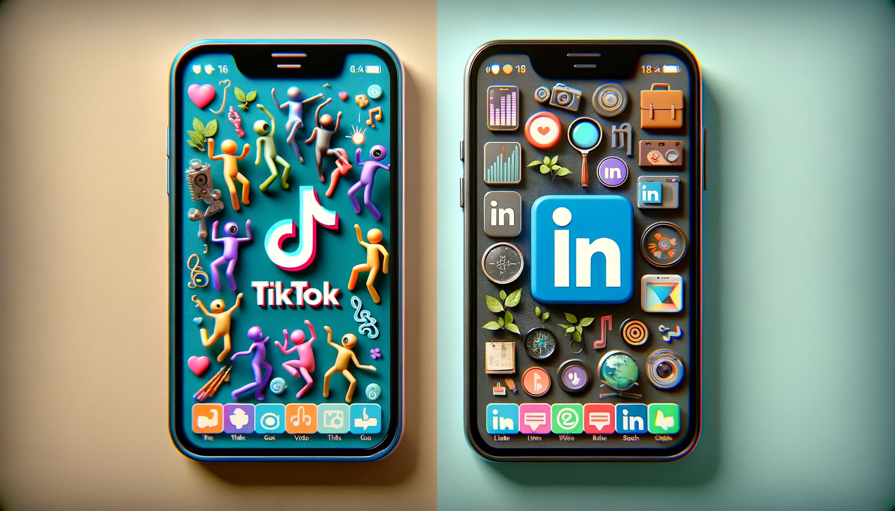

# PAC3: Visionant el futur amb les ulleres de Manovich
**Autor:** Eloi Limbos i Tena

**Assignatura:** Cultura digital - Aula 1 20.444

**Grau:** Tècniques d'Interacció Digital i Multimèdia

**Curs:** 2023-2024

## Plantejament

**Què és la hibridació?** La hibridació, en el referent als nous mitjans digitals, és un concepte desenvolupat per Lev Manovich; aquest implica la fusió de diferents mitjans i tècniques per a crear noves formes d'expressió digital.
> *Insisto: Despúes de un primer estadio en que la mayor parte de medios preexistentes fueron simulados por software [...] entramos en un nuevo periodo regido por la hibridación.*
> 
> <small>**Lev Manovich.** <small>_**El software toma el mando.** 3 La hibridación. La evolución del metamedio ordenador._</small></small> 

**Diferència entre hibridació i multimèdia?** Manovich les diferència clarament. La multimèdia implica la col·locació d'elements en un mateix context però funcionant cadascun d'aquests elements de manera individual; en canvi, la hibridació requereix una modificació de l'element per a integrar-lo de manera en que tots aquests tinguin una fusió molt més profunda on les tècniques i propietats dels elements és mouen o reconfiguren per crear noves tècniques i funcions.
> *En documentos y aplicaciones interactivas **multimedia**, los contenidos de cada medio **aparecen uno junto a otro**. [...] Por contra, en los **híbridos de medios**, [...] **se fusionan** para ofrecer una experiencia nueva y coherente, que es distinto a experimentar los elementos uno por uno.*
> 
> <small>**Lev Manovich.** <small>_**El software toma el mando.** 3 La hibridación. Comparación entre hibridez y multimedia._</small></small>

**Exemples d'hibridació:** Per a mostrar casos reals d'hibridació, s'han seleccionat dos casos molt paradigmàtics, ja que si bé ambdós tenen com a base comuna que són xarxes socials, hibriden en sentits totalment oposats per a adaptar-se a dos perfils de persona usuària molt diferenciats. Aquestes són **TikTok** i **LinkedIn**.

Aquests exemples tenen un fort arrelament cultural, especialment reconeixible en el cas de *TikTok*, ja que és la xarxa social de referència de la joventut i adolescència actual. Aquesta fomenta la creativitat i l'expressió personal, i ha democratitzat l'"art digital" permetent que qualsevol persona pugui convertir-se en creadora, independentment del seu context socioeconòmic. *LinkedIn*, en canvi, se centra més en la cultura dels negocis, ajudant els i les professionals de cada sector a transmetre la seva experiència i casos d'èxit a les altres persones usuàries de la xarxa a través de blogs, articles, ponències i formacions. Això proporciona inspiració, motivació i creixement personal per als seus propis negocis.

## Redescobrint la hibridació: *TikTok*
**TikTok** és una plataforma d'origen xinès, desenvolupada per ByteDance el 2016, destinada a que les persones usuàries poguessin compartir vídeos curts. Originalment es va anomenar Douyin, però va passar al nom actual quan va començar la seva fase d'expansió i internacionalització. Aquesta va succeir quan va adquirir la plataforma Musical.ly, coneguda pels vídeos amb *lip-sync* (sincronització de llavis). Actualment, *TikTok* està disponible en més de 150 països i 75 idiomes.

És un excel·lent exemple d'hibridació ja que ha passat a ser una plataforma que permet, de manera integrada en el seu propi funcionament:
- **Ser una xarxa social:** Disposa de tots els elements habituals d'aquestes, com un perfil personalitzat amb la informació que vols compartir, la capacitat de seguir i ser seguit per altres persones, i interactuar amb el contingut mitjançant "M'agrada" o similar.
- **Crear contingut audiovisual:** Permet que de manera molt senzilla puguis editar vídeo, fotografies o àudio per generar infinitat de contingut per compartir a la plataforma. Aquest contingut, conegut com a *ForYou*, consisteix en vídeos de 15 a 60 segons que poden anar-se desplaçant de manera infinita mitjançant un scroll infinit. Aquest és l'element més icònic i original de la plataforma, el qual ha estat fortament imitat per la competència com Instagram (*Reels*) o YouTube (*Shorts*).
- **Efectes i filtres de Realitat Augmentada (RA):** La plataforma incorpora un gran nombre de filtres de RA. Aquests van ser desenvolupats originalment per *SnapChat*, però *TikTok* ha sabut portar aquests filtres molt més enllà. Ha abandonat els efectes entranyables de "Gosset" o "Vampir" per a oferir una gamma de filtres que permeten quasi qualsevol cosa imaginable, com encongir el cap (*Tiny Head*), submergir-te sota l'aigua (*Ocean Life*), viatjar per l'espai (*Astronaut*), cabells de neó (*Cyberpunk*), maquillatge virtual (*Beauty Studio*), provar-te roba (*Try-On*), provar tons de pintallavis abans de comprar-los (*Makeup Tester*), etc.
- **Música, sons i dansa:** Disposa d'una enorme biblioteca musical i de cinema gràcies a acords amb segells com Sony Music, Warner Music i Universal Music. Això permet realitzar molt contingut de *lip-sync* i reptes de ball, de la mateixa manera que permet a artistes sense gran renom que les seves cançons puguin tornar-se virals.
- ***Hastags* i *Challenges:*** La plataforma fomenta la participació comunitària mitjançant reptes virals (*Challenges*) identificats amb *hastags* (característica importada globalment des de *Twitter*), pensats perquè les persones usuàries els repeteixin i comparteixin a la xarxa.
- **Transmissió en viu:** La plataforma permet transmetre vídeos en viu, amb els quals les persones creadores de contingut poden interactuar de manera més directa i personal amb qui els segueix. Aquesta característica ha estat implementada d'altres plataformes més específiques com *YouTube* o *Twitch*.
- **Contingut educatiu:** Encara que és una plataforma molt destinada a contingut purament lúdic, existeixen certes persones creadores de contingut que han vist en aquesta plataforma la possibilitat de fer arribar la ciència, la tecnologia, la naturalesa, etc., a aquest públic més jove aprofitant el format "*fast*" dels vídeos curts, en el que s'anomena "ciència (o cultura) en píndoles". Grans exemples serien per exemple els creadors de contingut [@thequantumfracture](https://www.tiktok.com/@thequantumfracture) o [@doctorfision](https://www.tiktok.com/@doctorfision) amb 588k i 4.5M de seguidors/es respectivament. L'aparició d'aquest tipus de contingut permet que també hi hagi un component educatiu, fomentant l'aprenentatge informal.

De manera més recent, han afegit funcionalitats molt interessants com els Duets, que permeten, mitjançant una pantalla partida, interactuar directament amb el contingut creat per altres persones usuàries de la xarxa.

Si bé *TikTok* és una xarxa molt interessant amb molta capacitat d'interacció social i de creació artística, també disposa de certs aspectes que resulten preocupants:
- **Privadesa de les dades**: Preocupa el seu origen xinès i que les dades siguin entregades al govern sense consentiment. Això ha comportat que la plataforma sigui prohibida o restringida a diversos països.
- **Addicions i salut mental**: *TikTok* té possiblement l'algoritme més ràpid i precís de les diferents xarxes socials, que mostra contingut molt basat en les preferències i gustos de la persona usuària. Aquest afegit al scroll infinit genera greus problemes d'addicció, especialment entre el públic jove o adolescent amb un cervell encara en desenvolupament, augmentant el risc de fracàs escolar.
- **Desinformació, abusos i contingut perillós**: *TikTok* ha tingut molts problemes, ja que ha fomentat la transmissió d'informació falsa, contingut ofensiu o abusiu, i reptes virals molt perillosos que posaven en perill la integritat física de qui intentava realitzar-los. La reacció de la plataforma per evitar aquests problemes ha estat sovint molt tèbia.

En conclusió, *TikTok*, més enllà de la qualitat dels continguts que s'hi puguin generar o dels riscos, és una aplicació amb un potencial creatiu enorme que hibrida de manera excel·lent els elements de xarxa social, creació audiovisual i Realitat Augmentada.
## Redescobrint la hibridació: *LinkedIn*
**LinkedIn** és una plataforma d'origen nord-americà, creada per Reid Hoffman, Allen Blue, Konstantin Guericke, Eric Ly i Jean-Luc Vaillant el 2002. Va ser concebuda per digitalitzar el procés tradicional de connexió professional, donant pas a un networking col·laboratiu més àgil i eficaç. Degut a la seva especificitat, el seu creixement va ser gradual i més lent que altres xarxes socials, però al ser una eina professional i no d'oci, també va aconseguir que el seu perfil d'usuaris fos persistent i difícilment seduïble per altres xarxes. Dintre de la seva trajectòria històrica, destaca el 2016, quan va ser adquirida per *Microsoft*.

Actualment, *LinkedIn* està disponible en més de 200 països, té més de 1.000 milions de persones registrades i està disponible en 26 idiomes. L'idioma ha estat una de les polèmiques a casa nostra, quan el 2016, davant una potent campanya de Plataforma per la Llengua, es van negar a introduir-hi el català.

Una diferència important respecte a la resta de xarxes socials és que la seva viabilitat econòmica depèn en gran mesura de les subscripcions prèmium. Donat el sector al que va adreçada, utilitzar algorismes per captar informació dels usuaris i vendre-la a tercers podria ser contraproduent. Per tant, la informació a transmetre i el perfil d'anunciants és molt més limitat, amplificant encara més, si escau, el cercle específic d'usuaris de la plataforma.

És un exemple peculiar d'hibridació, ja que, si bé fusiona de manera eficient i orgànica diverses funcionalitats en la seva interfície, aquestes, en lloc de centrar-se en obrir la plataforma al màxim públic possible, es centren en millorar uns serveis molt específics per al seu públic objectiu, amb el qual es pot definir clarament com una plataforma força "tancada". Entre les seves funcionalitats híbrides destaquen:
- **Ser una xarxa social:** Disposa dels elements d'una xarxa social, com un perfil personalitzat amb la informació que vols compartir, la capacitat de seguir i ser seguit per altres persones, i interactuar amb el contingut mitjançant "M'agrada" o similar. També disposa d'una "jerarquia de contactes" amb la qual els contactes dels teus contactes també et consten com a contactes de 2n o 3r grau, cosa que permet i facilita ampliar la teva xarxa a través de contactes en comú.
- **Crear contingut propi:** Permet crear publicacions al teu mur, afegir contingut multimèdia i escriure els teus propis articles con puguis expressar-te professionalment. En tot cas, la capacitat d'edició és molt limitada i per tant has d'editar les teves creacions multimèdia en una aplicació externa per a publicar-la.
- **Borsa de treball:** Ofereix un excel·lent marc per promocionar-te per buscar feina o millorar la que tens, així com per contractar personal si en necessites. Disposa de moltes eines i filtres que permeten publicar el teu anunci o promocionar el teu currículum.
- **Serveis de venda i promoció:** Pots promocionar i publicitar els teus serveis, especialment enfocats al tercer sector i en productes afins al sector professional. La venda de productes -excepte certs productes professionals- o de productes per al consumidor no són els més adequats per a la plataforma.
- **Formació:** A través de _LinkedIn Learning_, els usuaris/es premium (de pagament) poden accedir a molts cursos de formació realitzats per professionals.
- **Notícies especialitzades:** Pots seguir les notícies dels sectors que t'interessen i estar al dia de les novetats.

*LinkedIn*, al ser una plataforma molt específica i especialitzada, en general és molt fiable i amb pocs riscos, no obstant no és totalment aliena a aquests, per exemple:
- **Privadesa:** La plataforma va patir un important hackeig el 2012 que va exposar les dades de milions de persones usuàries, no obstant no seria just tenir-ho en consideració avui en dia, ja que estar sota el paraigües de Microsoft dona força garanties de protecció.
- **SPAM i sol·licituds no desitjades:** Aquest és el problema més recurrent de la plataforma. Si facilites que pugui contactar-se amb tu de manera universal per facilitar que pugui contactar possible clientela potencial, reps molts missatges de màrqueting no desitjats. De la mateixa manera, en ocasions es reben massa sol·licituds de connexió per part de persones que no tens relació i que són d'un sector que no té interès professional per a tu, però que només busquen ampliar indiscriminadament la seva xarxa de contactes.
- **Desinformació i contingut inadequat:** Tot i que en menor mesura que altres plataformes, LinkedIn també ha estat víctima d'informacions falses o de contingut inadequat.
- **Descompensació entre comptes gratuïts i premium:** Al basar gran part dels seus ingressos en les subscripcions prèmium, existeix una gran descompensació entre els serveis del compte gratuït i els comptes de pagament.

En conclusió, *LinkedIn* és una plataforma que combina funcionalitats molt interessants centrades en el networking professional, perquè les persones o les empreses (que també poden crear-se un perfil propi) puguin contractar personal o evolucionar professionalment, conèixer el mercat, crear una xarxa de contactes, etc. Té un públic més limitat que altres plataformes, però molt més fidelitzat.

### Referències i bibliografia

#### - Documentació
- Manovich, Lev. (2013). **El Software toma el mando**. Barcelona: Editorial UOC.

#### - Webgrafia
- Editors/es de l'Enciclopèdia Britannica (2024, 23 de maig). **TikTok**. Encyclpaedia Britannica (Britannica.com). Localitzable a: <https://www.britannica.com/topic/TikTok>
- Col·laboradors/es de Viquipèdia (n.d.). **TikTok - Viquipèdia, l'enciclopèdia lliure**. Viquipèdia (ca.wikipedia.org). Localitzable a: <https://ca.wikipedia.org/wiki/TikTok>
- Big 3 Media (2020, 31 d'agost). **A Brief History Of TikTok And Its Rise To Popularity**. Big 3 Media (big3.sg). Localitzable a: <https://www.big3.sg/blog/a-brief-history-of-tiktok-and-its-rise-to-popularity>
- arfected (2024). **TikTok filters: your best guide to creating viral AR filters**. ARfected (arfected.com). Localitzable a: <https://arfected.com/page/tiktok-filters>
- Filter Experience (2023). **Creating TikTok filters for your brand! How to create a TikTok filter?**. Filter Experience (filter-experience.com). Localitzable a: <https://filter-experience.com/tiktok-filter/>
- Thomas, Monique (2022, 26 de maig). **The Ultimate Guide to TikTok Marketing**. Later Blog (later.com). Localitzable a: <https://later.com/blog/tiktok-marketing/>
  
- Reynolds, Richard (2024, 16 d'abril). **The Complete History of LinkedIn: Everything You Need to Know**. History Computer (history-computer.com). Localitzable a: <https://history-computer.com/business/companies/the-complete-history-of-linkedin/>
- Gregersen, Erik (2024, 21 de maig). **LinkedIn**. Britannica Money (britannica.com/money). Localitzable a: <https://www.britannica.com/money/LinkedIn>
- Equip de TRUiC (2023, 17 d'octubre). **The LinkedIn Story: Origins and Growth Strategy**. TRUiC Startup Savant (startupsavant.com). Localitzable a: <https://startupsavant.com/startup-center/linkedin-strategy-story>
- Col·laboradors/es de Viquipèdia (n.d.). **LinkedIn - Viquipèdia, l'enciclopèdia lliure**. Viquipèdia (ca.wikipedia.org). Localitzable a: <https://ca.wikipedia.org/wiki/LinkedIn>
- LinkedIn Corporation (2024). **Acerca de LinkedIn**. LinkedIn (linkedin.com). Localitzable a: <https://about.linkedin.com/es-es>

#### - Citació de la IA
- **OpenAI (2024)**. *ChatGPT 4 Omni (versió maig 2024)*. Generació d’imatges per IA generativa, imatge decorativa de comparació entre TikTok i LinkedIn.
- **OpenAI (2024)**. *ChatGPT 4 Omni (versió maig 2024)*. Cerca de fonts d'informació que parlin sobre els productes objecte d'estudi.
- **OpenAI (2024)**. *ChatGPT 4 Omni (versió maig 2024)*. Correcció ortogràfica i gramatical per a millorar-ne la presentació, instrucció exacta la següent:

  <small>*“Et passo uns fragments de text, has de corregir només ortografia i potser algun petit ajust de coherència i ordre, però has de respectar el text original mantenint les meves expressions i ús de paraules, no has d’eliminar ni afegir informació, ni resumir ni alterar el sentit de cap manera.*</small>

  <small>*L’estructura ha de ser la següent:*
*1. Text corregit.*
*2. Enumeració de les correccions i canvis realitzats.”*<small>

----

Licencia: Material Creative Commons desarrollado bajo licencia CC BY-SA 4.0
